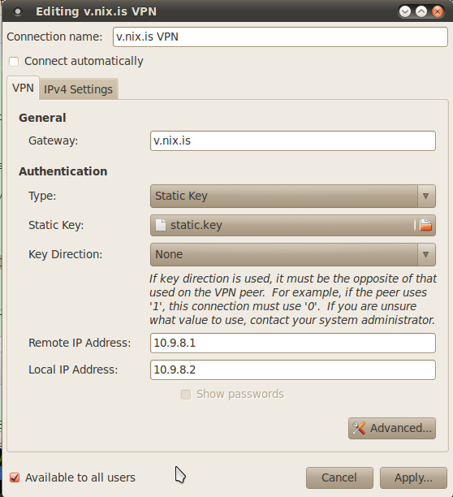

# OpenVPN server setup

On v, as documented
[on the debian wiki](http://wiki.debian.org/HowTo/openvpn):

openvpn
    openvpn --genkey --secret static.key
    
Then start openvpn:

openvpn start
    
# Manual client setup

tun0.conf`:

    remote v.nix.is
    dev tun0
    ifconfig 10.9.8.X 10.9.8.1
    secret static.key
    
Replace `X` with some number, e.g. `3`, `1` is v, `2` is avar's
laptop.

# GUI client network-manager setup

openvpn`, or somewhere else
secure. Then set things up like this in GNOME's
NetworkManager. Adjusting `Local IP Address` to something else:

Now you should be able to start the VPN connection and ping v:

    $ ping -c 1 10.9.8.1
    PING 10.9.8.1 (10.9.8.1) 56(84) bytes of data.
    64 bytes from 10.9.8.1: icmp_seq=1 ttl=64 time=85.7 ms
    
And ping your client from v:
    
    $ ping -c 1 10.9.8.2
    PING 10.9.8.2 (10.9.8.2) 56(84) bytes of data.
    64 bytes from 10.9.8.2: icmp_seq=1 ttl=64 time=45.1 ms
    
And your routes will look like this:
    
